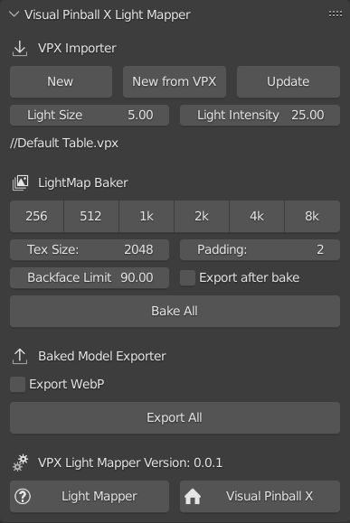

# Visual Pinball X Light Mapper

*A [Blender](www.blender.org) add-on to help building pretty baked tables for the [world's favorite pinball simulator](https://github.com/vpinball/vpinball).*

## Disclaimer

This tool is a hobby project, developped independently from the great team behind Visual Pinball X. Please do not bother them with issues regarding this tool.

This tool is just my attempt at building better tables. It is shared in the hope that it may help others to build nice tables. There is no dedicated ressources behind this project. It is in a pre-alpha state, with no support. There are bugs more or less everywhere, so it is to be used with extreme care and at your own risk!

## Table of contents

* [What is it ?](#what-is-it)
* [Features](#features)
* [Installation](#installation)
* [Overview](#overview)
* [Import Tool](#import-tool)
* [Bake Process](#bake-process)
* [Export Tool](#export-tool)
* [Quick Start](#quick-start)
* [Advanced Informations](#advanced-informations)

## What is it ?

[Visual Pinball X](https://github.com/vpinball/vpinball) is a game engine dedicated to pinball game simulation. It is a great tool which has allowed a whole community to grow and produce incredible pinball tables ([VPForums](https://www.vpforums.com), [VPUniverse](https://www.vpuniverse.com), [Orbitalpin](https://www.orbitalpin.com), [Pinball Nirvana](https://www.pinballnirvana.com), [VPDB](https://www.vpdb.io), [PinSimDB](https://www.pinsimdb.org),...). For the graphic part, it includes a nice realtime rendering engine which allows great visual results. 

To obtain the best visuals, table creators may choose to precompute part of the rendering of their table in a more advanced offline renderer like [Blender](www.blender.org), a.k.a. "baking" the lighting. This works especially nicely for pinball games since the game is played from a fixed point of view, allowing to efficently bake view dependent lighting effects. 

The visual quality of a pinball simulation is also tighlty linked to the rendering of the many (up to hundred) lights that are used in a pinball. The texture baking approach can be extended regarding precomputing the effect of lighting by using "light maps", that is to say models with precomputed textures storing the effect of lights. These models are a shell around the table objects, with texture storing the lighting. When playing the pinball table, they are renderered by adding the lights contribution to the base model.

This tool aims at helping with the process of creating VPX tables by:
- easing importing and table inspection,
- easing camera setup,
- automating the full bakemap/lightmap process, with a good level of optimization.

## Features

This toolkit offers the following features:
- Import VPX table including lights & materials, easily update edited table
- Setup camera according to VPX camera, including 'layback' support
- Automatically detect occluded objects taht can be exclude from bake meshes
- Automatically setup groups of non overlapping objects
- Batch render bakemap/lightmap, automatically optimizing renders
- Generate mesh for baked mesh and lightmaps, optimizing them (pruning of unneeded faces for lightmaps, limited dissolve, backface removal,...), generating optimized combined UV map accross the mesh set
- Render packed texture combining all the bakemap/lightmap
- Export directly playable VPX table file with updated geometry, textures and script

## Installation

### Blender Console

This add-on use the Blender console for all its output. You need to enable the console before everything else (Window > Toggle System Console).

### Blender add-on

1. Download add-on (zipped) from the [release section](https://github.com/vbousquet/vpx_lightmapper/releases).
2. In blender, go to : Edit -> Preferences -> Add-ons -> Install.
3. Select the downloaded file.
4. This add-on requires external python dependencies that may not be available with your Blender installation. If so, it will show an 'install dependencies' button that you need to perform before use. Depending on your security configuration, this additional installation step may need to be performed from a Blender instance started with administrator rights. You may also have to restart Blender after installation.

### Visual Pinball X with additive blended primitives

Additionnally, this tool use an experimental build of Visual Pinball X which adds additive blending support. It is available [here](https://github.com/vbousquet/vpinball/tree/additive-blend) (source only, builds are not yet publicly available). Please be aware that THIS BUILD MUST NOT BE USED except for experimenting with the light mapper. It is likely that it will break your tables if you open and save them with it.

### Better packing of UV maps

At some points bake maps have to be tightly packed in a big UV map. For this, Blender offers a default operator called 'Pack Islands' which give not that good results. For better packing, you should install and use another UV map packing tools like:
- [UV Packer](https://www.uv-packer.com/) which works great (far better than Blender's default) and is free,
- [UV Pack master](https://uvpackmaster.com/) which is known to give very good results, but needs a paid license.

This add-on natively supports the free [UV Packer](https://www.uv-packer.com/) and fully integrates with him for batch processing. To use this feature, you need to download the UVPacker exe and place it in the addon folder.

## Overview

This tool is splitted in 3 modules which are accessed through the usual Blender UI panes: a VPX file importer, a lightmap baker, and an exporter.

The workflow can be whatever you want, but the tool was designed around the following one:
1. Create a table in VPX
2. Import the table in Blender (or update if this is done after the first iteration) 
3. Adjust the generated baking configuration (light groups, bake groups, bake modes,...)
4. Improve the materials and adjust the lights in Blender
5. Bake
6. Review the result direclty inside Blender
7. Export an updated table with all the bakes and and updated script with lightmap synchronization integrated
10. Test and adjust light factors in VPX, eventually go back to step 2, using update button
11. When the table is ready to be released, export using the option to remove all the hidden visual elements and initial textures to get a small file size.

The tool expects a scene using the following collections:
- 'VLM.Trash': deleted objects, not rendered
- 'VLM.Hidden': hidden objects, not rendered
- 'VLM.Indirect': objects which are not baked (not included in the output meshes and textures) but *indirectly* influence the lighting. For example this can be used for trigger wires, gate wires,...
- 'VLM.Overlays': objects which are not baked (not included in the output meshes and textures) but *directly* influence the lighting. For example this can be used for insert text overlays,...
- 'VLM.Light Groups': this collection hosts sub-collections which define each lighting situation (see below).
- 'VLM.Bake Groups': this collection hosts sub-collections which define each bake group (see below).

The UI is available in the scene property panel, inside the "VPX Light Mapper" pane. Specific options are also available in the information (N key) panel of the 3D view and the collection property panel (bake & light groups configuration).

## Import tool

The import tool is used to create a scene setup (empty or from an existing table), then update it. The initial imports will create the default collections, loads everything and try to set up the right collections. A few things to note:
- All flasher are imported initially hidden since they are mainly use for lighting effects. You will have to move the ones you need to the wanted bake groups.
- Lights are imported as emitting geometry or point lights depending on the 'bulb' option in VPX. Lights which arelikely inserts follow a specific process (generate a slightly reflective cup below playfield, generate a translucency map for the playfield)
- Movable parts of gates, spinner, triggers and bumpers are placed in the indirect collection.

When updating, the process is the following:
- All textures are reloaded
- Objects link to groups (VPX.Hidden/VPX.Bake/...) are left untouched except for deleted objects which are moved to VPX.Trash
- World environments (IBL and Black) are (re)created if missing. The environment texture is updated in the shader node named 'VPX.Mat.Tex.IBL'
- Objects are identified by their name, following the template that a table element has the same name in Blender, prepended with 'VPX.' and its type (for example 'VPX.Wall.Apron'). If object is not found, it is created like on initial import but if object is found, it is updated according to its configuration (available in the 3D View side panel):
	- If not disabled, meshes/curves are replaced by the ones defined in the VPX table,
	- If not disabled, position/rotation/scale are redefined to match the one of the VPX table
	- If the material slot is empty, it is (re)created.
	- If the material slot use a material with matching material name, the core material node group and image texture of the material are updated with VPX material data

Therefore, if you modify an object, you have to disable the corresponding import properties or your changes will be lost on the next update.

To take control of a material, either change the material to a non 'VPX.' named one or simply modify inside the existing material (which will still get updates but only on the aforementioned nodes. Other objects with the same material/image pair will use the same Blender material and therefore will have these changes applied too).

## Bake process

The texture baking is performed according to:
- Light groups, which define each lighting situation to be computed, (additionally to baking the base situation which is only lit by the environment),
- Bake groups, which define groups of object to be baked together and exported into a single merged mesh.

The lightmap baker automates all the baking process according to the following workflow for each bake group:
1. Identify non overlapping groups of objects from the camera point of view
2. For each light situation, render each non overlapping object groups from the camera point of view and store these renders in a cache
3. Generate a base optimized mesh from all the objects, suitable for fixed view baking (including preliminary mesh optimization, and automatically subdivision to avoid projection artefacts)
4. For each light group, derive an optimized mesh by removing unlit faces
5. For each of these meshes, prepare a packed bake map from the initial renders
6. Combine all this packed bake/lightmap together, except for playfield bakemaps

In the collection property panel, each bake groups has a 'bake mode' which determine how it will be processed:
- Default
	- Solid bake outputs splitted mesh per bake group
	- Light map bake meshes are merged together (including the ones baked in playfield mode groups)
- Playfield
	- Solid bake outputs splitted mesh per bake group, with a texture projection corresponding to the playfield orthographic view (i.e. a texture that can be used as a playfield image in VPX)
	- Light map behave exactly the same as in default mode and are merged together (including the ones from default mode groups)
- *TODO* Movable
	- Solid and light map bake outputs splitted mesh and image per object in the bake group, keeping each object origin

Note that playfield bake mode is rendered from the camera point of view to have the right view dependent shading.

This configuration is needed due to the fact that light bakes and solid bakes have different constraints:
- Light bakes all end up with the same material in VPX (active, no lighting), they can be combined together to limit the number of draw calls, except for movable parts
- Solid bakes are more complex:
	- Static geometry is the best performance wise but is not applicable for non opaque parts, lower playfield, movable parts,...
	- Non baked lights (classic inserts, playfield text and alpha inserts borders overlay) need a playfield mapped image (no perspective, ortho UV projection)
	- Non opaque objects need an 'active' material, so should be baked to a separate mesh from static ones
	- Obviously, movable objects (diverters,...) need to be moved during gameplay, so be baked separately (solid and light maps) keeping their own origin

Light groups are defined as sub-collections of 'VLM.Light Groups'. In the collection property panel, each group can be configured to be either baked as a group of lights (only one bake for all the lights of the group, for example  GI lighting of the playfield) or per light (one bake per light, for example for inserts or flashers).

To avoid ending up with very large meshes (in terms of number of faces, as well as overdraw when rendering in VPX), all produced meshes are optimized by:
- pruning duplicate vertices,
- performing a limited dissolve of the mesh (see Blender doc),
- performing backface culling,
- removing unlit faces from lightmaps.

## Export tool

Exporting consist of generating a new VPX table file with:
- the new packed bake/lightmap images,
- the bake/lightmap primitives,
- an updated script for lightmap synchronization,
- a timer to drive the script.

The exporter has an option to decide what to do with the initial items of the table that have been baked:
- Default: don't touh them,
- Hide: hide items that have been baked,
- Remove: remove items that have been baked and do not have physics, hide the one that have been baked but are needed for physics,
- Remove all: same as remove, but also remove images that are not needed anymore.

## Quick start

This little guide gives you the step to create your first lightmap baked table:
1. Open VPX and create a new table (Ctrl+N), then save it.
2. Open Blender, install the add-on, opne the Blender console
3. Delete everything from the default Blender scene
4. In the scene panel, press the 'New from VPX' button, and select the saved VPX table
5. Press 0 for camera point of view
6. In the 3D view, in thr ight panel (N shotcut), select the VLM pane
7. In the 3D view, select the primitives on the left and right side of the table, then click 'Hide' in the VLM side panel
8. In the 'Active' collection, select all shadow objects ('FlipperRsh', 'BallShadow1',...) and press the 'Hide' button of the VLM side panel
9. Move the remaining primitive of the 'Active' collection to the 'Default' collection
10. Save your scene
11. In the scene panel, select a target resolution (start with very low for an ugly but fast preview), then press 'Batch Bake & Export'
12. Wait (this may be long depending on your computer and the resolution), watching in the console what is happening
13. Open the new VPX table with the version of VPX that supports additive blended primitive and play !
14 You can also preview/inspect the result directly in blender: select 'Rendered' mode for the 3D View, you now have a pink table! Select it, and press 'Load/Unload Renders' in the VLM panel to view it with the baked textures. Do the same for the different bake mesh you want to inspect.

Additionally, you should install UV Packer addon, then:
- Select the 'bake results' objects, the side panel will show to which packmaps they belong. Press 'Select' in the side panel to select all the baked objects belonging to the same packmaps
- Pack the UV island using UV packer, with the right padding/texture size, and 'rescale  UV charts' unchecked
- Do it for each of the packmap, except the playfield
- Clear the packmap cache (the 'Export' folder in the cache)
- Press the 'Packmap' button, then the 'Export' button

## Advanced informations

### Optimizing the bake mesh (and render time)

As much as possible, you should avoid including occluded (not directly visible) geometry from your bakes. To help you in doing so, teh addon offers a small tool that will identify occluded geometry from the camera view point. You can then choose to mark is as 'Indirect' (it will influence the image but won't be part of the bake mesh). This tool can be accessed from the 3D view, by clicking the button 'Select Occluded'. Note that this can be a lengthy operation. Another side benefit of tagging as indirect the occluded geometry is that this will help limiting the number of render groups, and therefore limit the render time.

### Plastics

The importer has an option to detect plastic walls and process them accordingly. If set, all thin walls will be processed like this:
- place the top material at the bottom, and set it to be shaded as translucent instead of diffuse,
- set side and top material to a predefined transparent plastic material,
- bevel the edges of the resulting mesh (only for baking, the bevel is not exported).

### Inserts

The importer has an option to detect inserts (lights placed on the playfield, with a name which does not start by 'gi') and apply the following process:
- move light slightly below playfield,
- generate a cup mesh, opened on the top side, corresponding to the VPX light shape, with a core reflective material,
- adjust the playfield material to be partly translucent for the inserts, using an automatically generated translucency map.

Another way of baking inserts is to make them fully transparent in the playfield texture, then place a little, black shaded, cup corresponding to their shape to give them some depth. Then the plastic unlit detailled model is placed in the overlay collection, and a light or an emitter mesh is placed at the bottom of the cup.

### Transparent objects (plastic ramps, bumper caps,...) and alpha blending

Visual Pinball X performs alpha blending of transparent objects. This means that the object is rendered on top of objects behing it, blending the color between them according to the alpha channel of the used texture. This can be compared to the shading of a transparent glass with an indice of refraction of 1 (i.e. non refractive glass).

Blender can render glass, outputing to the alpha channel the amount of escaping rays, that is to say rays that are transmitted through the glass and reaching the background. This is great since it gives full control on what is rendered to the user. To enable this, in 'Render Properties > Film > Transparent' check 'Transparent Glass' and increase 'Roughness Threshold'. In the case of a pinball table, transparent objects usually have other objects behind them, therefore rays are not escaping but reaching other elements. If we want to view a ball passing behind 2 elements, they have to be rendered as 2 layers: a background one, and an alpha blended one. To let Blender knows about this separation between the 2 layers, we need to place a mesh with an holdout shader.

Separating the layers for rendering is mandatory for the baked mesh which are rendered as a solid (opaque or alpha blended). For lightmaps, which are rendered as additively blended (added to the rest), this is not needed. Therefore the holdout shaded mesh is not needed for lightmaps. The toolkit provided a shader node group named 'VLM.Bake Info' that provides this shading, along with other baking information taht can be used in a custom shader.

Note that, with this setup, there won't be any shadowing, since there is no shadowing support inside VPX. So a ball passing under a transparent object will not occlude light coming from behind it.

