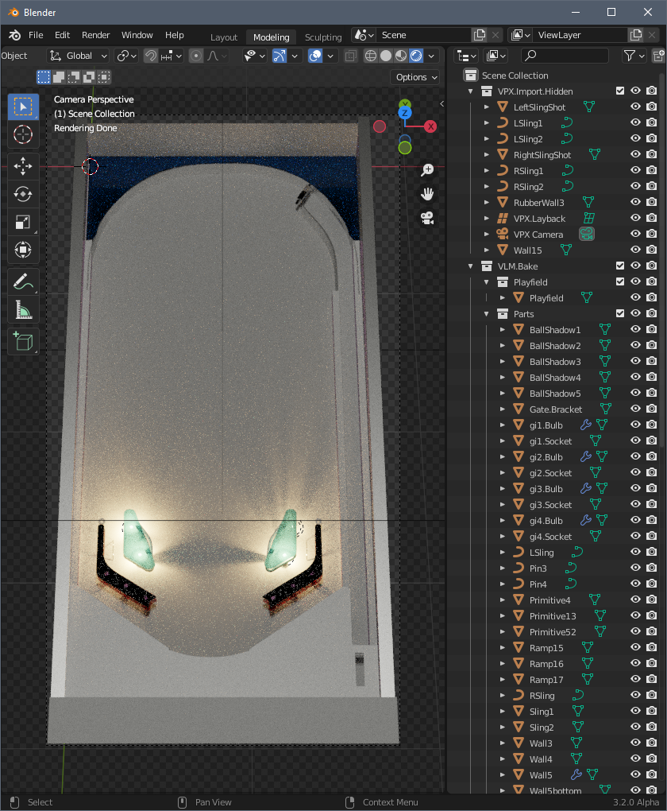

# Baking VPX's default blank table

This guide will take you through the steps to create a baked version of the base VPX's blank table. All the steps can be performed in less than 15 minutes and give the bases to understand the full process before going further.


## 1. Prepare the VPX table

The toolkit always needs a VPX table as a template for importing/exporting. Therefore, we will start by opening VPX, and select File > New > Completely Blank Table. Now simply save the table in a folder of your choice. This folder will also the one were the toolkit will store all the renders and baking data.


## 2. Import the table in Blender

Start Blender and delete the default scene setup (Right click on Collection in the Outliner, and select 'Delete Hierarchy'). You should now have an empty scene. Don't forget to open the console view (Window > Toggle System Console) to be able to see the toolkit outputs.

In the 'Property' panel select the 'Scene' panel, then, in the 'VPX Importer' pane, select 'Import' and navigate to the VPX file you have just created.




## 3. Cleanup the import and prepare for bake

The importer will try to organize VPX data in a usable way but there will always a few cleanup to perform before baking.

First, you do not want to bake the ball shadows primitives. So move the objects 'BallShadow1' to 'BallShadow5' from the VLM.Bake/Parts collection to the VPX.Import.Hidden one (you can uncheck this collection from the outliner to hide it and have a more readable workspace).

For better performance, you should also avoid baking elements that will be occluded at runtime. To identify them, the toolkit includes a tool in the 3D view side panel. So open the side panel and click on 'Select Occluded'. Then click on 'Default Render' button. It will toggle to 'Indirect Only' meaning that the selected objects will now only indirectly influence the scene (shadows, reflections & refractions) but will not be included in the final baked primitives.

The last thing we will tweak are the lights. The importer has created 2 lighting situations:
- one named 'World' which is the base bake, corresponding to the environment lighting,
- one named 'All Lights' with all the other lights.
The 'All Lights' collection's settings are to be baked as 'split' lights. This means that each light in the collection will produce a separate lightmap. We would end up with 4 lightmaps since there are 4 lights in this collection. Since these lights are GI lights which are turned on or off all together, what we want is a single lightmap for the 4 of them. To do so, we will change the setting of this collection from 'split' to 'group' in the collection property pane.


## 4. Batch process

Now that our scene is ready, we can use the 'Batch All' button. This will perform the following steps as batch:
1. Evaluate group of non overlapping objects that can be rendered together,
2. Render each group for each lighting situation,
3. Compute optimized bake and lightmap meshes,
4. Generate 'nestmaps' for the bake & lightmap meshes,
5. Export everything into a modified VPX table and generate an helper for updating the table script.

Before starting the batch, you will need to save your blender file first. It would be also a good time to change your render engine from CPU to GPU (in render settings panel of the property view).

Once the batch has completed (may be long), you will have a new collection 'VLM.Result' with all the generated meshes where you can preview the result, directly inside Blender. To do so, in render view mode, select the mesh you want ot preview, hide the others (Shift+H), and click on 'Load Renders' in the 3D VLM view pane.


## 5. Updating the table script

To finish with first bake process, get back to VPX and open the exported table. Open the table's script view and add the following block to the table script before running your first VPX baked table.

```
Sub Table1_Init
	gi1.Visible = False
	gi2.Visible = False
	gi3.Visible = False
	gi4.Visible = False
End Sub
```

This code disable the rendering of the VPX lights while keeping their reflection on balls.


## 6. Next steps

This example was kept very simple. At this step, you should have a global understanding of the process, and located were important UI parts are located. The other articles show how to animate the lighting, handle more complex situations like playfield inserts, plastic ramps and such.